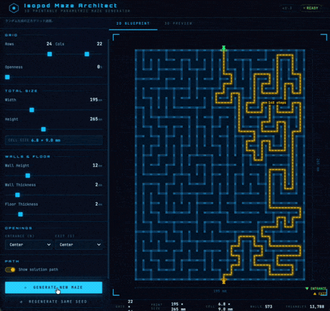
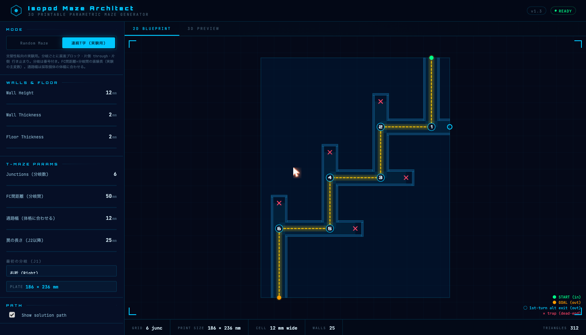
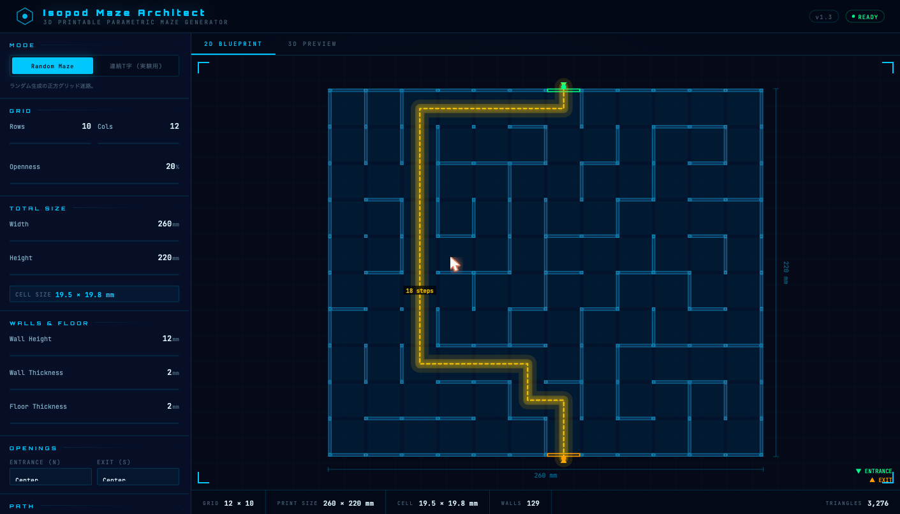
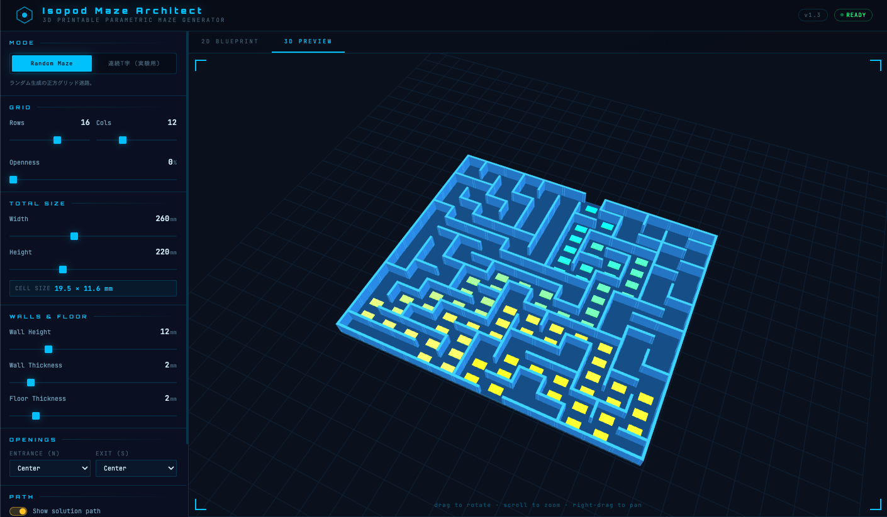

# Isopod Maze Architect

A single-file, browser-based **parametric maze generator for 3D-printable isopod (pill bug / ダンゴムシ) mazes**. Design a maze with sliders, preview it in 2D and 3D, and export a watertight STL ready for printing. No build step, no dependencies to install — just open `index.html`.

**▶ Live demo: https://gyroid-eth.github.io/isopod-maze/**



> ダンゴムシ（オカダンゴムシ等）の**交替性転向（turn alternation, TA）**を観察・実験するための迷路を、パラメトリックに設計して 3D プリントできる単一ファイルの Web アプリです。

### Serial T-maze mode (連続T字 / experimental)


### Random maze mode


### 3D preview


## Why

Isopods exhibit **turn alternation** (TA / 交替性転向): after turning right they tend to turn left next, then right again. It's a classic, accessible behavior experiment — popular in school science projects and studied in the literature. This tool lets you design the apparatus precisely (corridor width, turn spacing, number of junctions) and print a clean, reusable maze instead of taping plastic strips onto a board.

## Two modes

### 1. Random Maze
A classic square-grid maze (DFS recursive backtracker) with adjustable density ("openness" adds loops). Fully parametric overall size, wall height/thickness, floor thickness, and entrance/exit positions. The solution path is highlighted.

Optionally enable **TA solution** to make the maze's *unique* solution a turn-alternating (R, L, R, L …) staircase: the whole plate is one continuous maze with uniform walls, but only an animal that keeps alternating its turns can reach the exit — every wrong turn leads into a dead-end branch. (This is the "fill the entire plate with one continuous maze" form of the turn-alternation experiment; openness and entrance/exit position are overridden in this mode.) Each turn on the highlighted solution is labelled **L** (green) / **R** (pink) so you can read the alternation at a glance.

### 2. Serial T-Maze (連続T字 / experimental)
A staircase of numbered T-junctions purpose-built for turn-alternation (TA) experiments:

- The **through-path forces alternating 90° turns** — only an animal that keeps alternating reaches the goal.
- Each junction is a binary left/right choice; junctions are **numbered** so you can record the L/R sequence per trial.
- **FC distance** (the straight run between consecutive junctions) is the key experimental variable from the literature, set directly in mm.
- **Corridor width** is exposed prominently — it must match the body width of your specimens (pill bugs are ~4–7 mm wide); a mismatched corridor breaks the behavior.
- **Escapable exits**: the GOAL and the *first* junction's "wrong" branch are open exits (the first turn is a free reference turn, so both directions are valid). Every later wrong turn ends in a closed **dead-end trap** (marked ✕), so reaching the goal means the animal alternated correctly at every junction.
- The first turn (right / left) is selectable, mirroring the whole maze.

## Usage

Open `index.html` in any modern browser (Chrome/Safari/Firefox). That's it.

To serve it on your local network (e.g. to open from a tablet):

```bash
cd isopod-maze
python3 -m http.server 9876 --bind 0.0.0.0
# then visit http://<your-ip>:9876/index.html
```

1. Pick a mode.
2. Adjust the sliders; the 2D blueprint and 3D preview update live.
3. Click **Export STL** and slice/print.

## 3D printing notes

- The exported mesh is a **single watertight, manifold solid** (floor + walls fused, no self-intersections, no internal faces) so it slices cleanly with no base-layer artifacts.
- The floor follows the maze structure (the serial T-maze doesn't waste a big rectangular slab on the diagonal layout).
- Tune **corridor width** to your specimens, and keep walls/floor smooth — debris or a too-tight corridor will disrupt the turning behavior.
- Units are millimeters.

## Tech

- Vanilla HTML/CSS/JS in one file (`index.html`).
- [Three.js](https://threejs.org/) (via CDN) for the 3D preview; Canvas 2D for the blueprint.
- Geometry exported as binary STL. The solid is built as a height-field surface, guaranteeing a watertight mesh.

## Background & references

Turn alternation (TA; 交替性転向, also "turn alternation reaction / TAR") in *Armadillidium vulgare* and other isopods:

- "オカダンゴムシの交替性転向の仕組みを探る", *Kagaku to Seibutsu* 53(2): 130–132 (2015). https://katosei.jsbba.or.jp/view_html.php?aid=336
- "ダンゴムシの迷路実験をやってみた" (note.com) — a practical write-up showing how corridor width must fit the animal. https://note.com/yamakei90_/n/nb00d78dde9c3
- Moriyama, T. *ダンゴムシに心はあるのか* (山と溪谷社) — popular science book built around the T-maze experiment.

## License

[MIT](LICENSE) © 2026 gyroid
